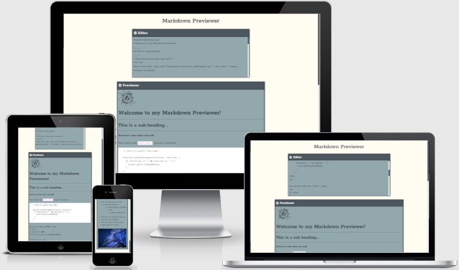

# Product Landing Page

This is a freeCodeCamp Markdown Previewer Project.

The overall aim was to acheive a Markdown Previewer Webpage, this was only focusing on using HTML, CSS, SASS and JavaScript to help me develop my front end skills further!

## Showcase

 

A deployed version of my website can be found [here](https://elliej87.github.io/PersonalPortfolioWebpage/)

This domain will allow you to access the Tribute Page website.

## Table of Contents

1. [User Experience UX](#userexperienceuX)

    * [User Stories](#userstories)

        - [User Story #1](#userstory_1)
        - [User Story #2](#userstory_2)
        - [User Story #3](#userstory_3)
        - [User Story #4](#userstory_4)
        - [User Story #5](#userstory_5)
        - [User Story #6](#userstory_6)
        - [User Story #7](#userstory_7)
        - [Site Owner Goals](#sitegoals)

2. [Wireframes](#wireframesboards)

3. [Features](#featuressite)

    * [Editor](#editor)
    * [Previewer](#previewer)

4. [Technologies Used](#technologies)

    * [Version Control](#versioncontrol)

5. [Functionality Testing](#functionalitytesting)

6. [Responsive Design Testing](#responsivedesigntesting)

7. [Validation](#validationcode)
    - [HTML](#htmlcode)
    - [CSS](#csscode) 

8. [Deployment](#deploymentsite)

    * [Repository Link](#repositorylink)
    * [Running Code Locally](#runningcodelocally)

9. [Credits](#finalcredits)

    * [Content](#contentsite)
    * [Acknowledgments](#acknowledgmentsthanks)

## <a name="userexperienceuX">UX (User Experience)</a>

This website was to help practice my JavaScript, SASS, HTML and CSS skills.

## <a name="userstories">User Stories</a>

### <a name="userstory_1">User Story #1</a>

- I can see a textarea element with a corresponding id="editor"

### <a name="userstory_2">User Story #2</a>

- I can see an element with a corresponding id="preview"

### <a name="userstory_3">User Story #3</a>

- When I enter text into the #editor element, the #preview element is updated as I type to display the content of the textarea

### <a name="userstory_4">User Story #4</a>

- When I enter GitHub flavored markdown into the #editor element, the text is rendered as HTML in the #preview element as I type (HINT: You don't need to parse Markdown yourself - you can import the Marked library for this: https://cdnjs.com/libraries/marked)

### <a name="userstory_5">User Story #5</a>

- When my markdown previewer first loads, the default text in the #editor field should contain valid markdown that represents at least one of each of the following elements: a heading element (H1 size), a sub heading element (H2 size), a link, inline code, a code block, a list item, a blockquote, an image, and bolded text

### <a name="userstory_6">User Story #6</a>

- When my markdown previewer first loads, the default markdown in the #editor field should be rendered as HTML in the #preview element

### <a name="userstory_7">User Story #7</a>

- Optional Bonus (you do not need to make this test pass): My markdown previewer interprets carriage returns and renders them as br (line break) elements

### <a name="sitegoals">Site Owner Goals</a>

- As a site owner I wanted to build on my JavaScript and SASS styling for this project.

## <a name="wireframesboards">Wireframes</a>

As this was a brief project no wireframes were designed prior to building this site.

## <a name="featuressite">Features</a>

This section is a brief highlight of features that this site contains.

### <a name="editor">Editor</a>

- Is central on the main body of the page
- Offset smaller than the previewer to hold a point of difference to the main previewer

### <a name="previewer">Previewer</a>

- Is central to the main body of the page
- Holds the same colour and feel as the Editor section

## <a name="technologies">Technologies Used</a>

[Bootstrap](https://getbootstrap.com)

- The project uses the Bootstrap framework to add a responsive grid system, prebuilt components, plugins built on jQuery, and Bootstrap styles to my site, before adding my own custom styling 

[CSS](https://en.wikipedia.org/wiki/CSS)

- The project uses CSS to apply the custom styles to create the look of my site.  The index.html file is linked directly to the main.css stylesheet

[Font Awesome](https://fontawesome.com/v4.7/) 

- The project uses Font Awesome icons for all navigation and social media links that feature in the header and footer of my site

Google Chrome Dev Tools

- For testing purposes for responsive design

[HTML5](https://en.wikipedia.org/wiki/HTML5)

- The project uses HTML to create the basic elements and content of my site 

[JavaScript](https://en.wikipedia.org/wiki/JavaScript)

- The project also uses JavaScript from Bootstrap which is required to add functionality to the bootstrap framework.  With this I have created additional JavaScript from te script.js file.

[jQuery](https://en.wikipedia.org/wiki/JQuery)

- The project uses jQuery to simplify DOM manipulation. This is both the standard jQuery that is built with Bootstrap components

[SASS](https://en.wikipedia.org/wiki/Sass_(stylesheet_language))

- The project uses SASS to apply the custom styles to create the look of my site.  The index.html file is linked directly to the styles.css stylesheet

[Visual Studio Code](https://code.visualstudio.com)

- I used Visual Studio Code as the development environment to write the code for my website

### <a name="versioncontrol">Version Control</a>

[Git](https://git-scm.com)

- I've used Git as a version control system to regularly add and commit changes made to project in Visual Studio Code, before pushing them to GitHub.

[GitHub](https://github.com)

- I've used GitHub as a remote repository to push and store the committed changes to my project from Git. I've also used GitHub pages to deploy my website in a live environment.

## <a name="testingcases">Testing</a>

# <a name="functionalitytesting">Functionality Testing</a>

Browsers tested: Google Chrome, Mozilla Firefox & Opera.
The devices used in this testing include Samsung S10 v.Android 10.

## <a name="validationcode">Validation</a>

### <a name="htmlcode">HTML</a>

W3C testing completed for: index.html
No issues were stated.
 
## <a name="csscode">CSS</a>

W3C testing completed for: styles.css
No issues were stated.

## <a name="deploymentsite">Deployment</a>

The hosting platform that I've used for my project is GitHub Pages. To deploy my website to GitHub pages, I used the following steps:

-	Loaded the terminal window in my visual studio code workspace
-	Initialised Git using the Source Control in the control panel
-	Files that have been amended are automatically listed in the ‘Source Control’ panel
-	Add message in the ‘Message’ section, making sure the commits are clear and concise (re-checked previous commits for layout and what was fixed / still pending)
-	Click the ‘tick’ icon which stored the files in visual studio code
-	Click the ‘ellipsis’ icon and select the ‘push’ option
-	This then push all files and commits to the main branch
-	This will add the updated files into the ‘main branch’ option under the ‘GitHub pages’ section
-	Ran several commits after testing was carried out throughout my project.

### <a name="repositorylink">Repository Link</a>

[Personal Portfolio Webpage](https://elliej87.github.io/PersonalPortfolioWebpage/)

### <a name="runningcodelocally">Running Code Locally</a>

To run my code locally, users can download a local copy of my code to their desktop by completing the following steps:

-	Go to my GitHub repository.
-	Click on 'Clone or download'.
-	Click on 'Download ZIP'.
-	Once downloaded, extract the zip file's contents and run my website locally.

## <a name="contentsite">Content</a>

This website was a quick and fun site for me to practice more web development skills and styling .

## <a name="acknowledgmentsthanks">Acknowledgments</a>

_**Created by Ellie Judge**_
